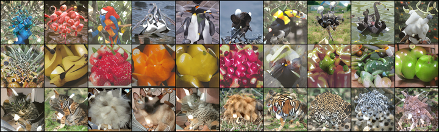
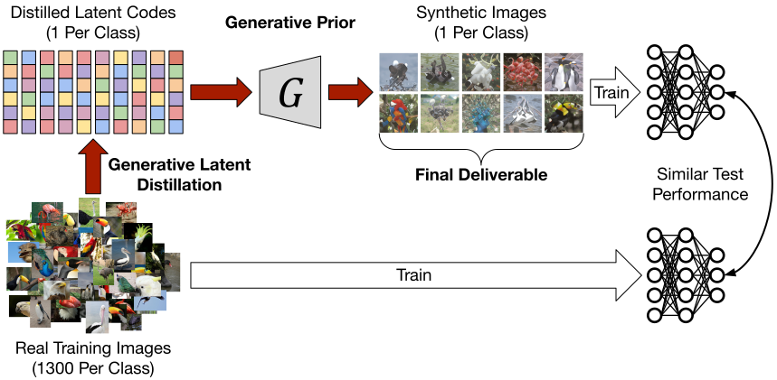

# GLaD 😊: Genenralizing Dataset Distillation via Deep Generative Prior

### [Project Page](https://georgecazenavette.github.io/glad) | [Paper](https://georgecazenavette.github.io/glad)
<br>



This repo contains code for training expert trajectories and distilling synthetic data from our GLaD paper (CVPR 2023). Please see our [project page](https://georgecazenavette.github.io/glad) for more results.


> [**Dataset Distillation by Matching Training Trajectories**](https://georgecazenavette.github.io/mtt-distillation/)<br>
> [George Cazenavette](https://georgecazenavette.github.io/), [Tongzhou Wang](https://ssnl.github.io/), [Antonio Torralba](https://groups.csail.mit.edu/vision/torralbalab/), [Alexei A. Efros](https://people.eecs.berkeley.edu/~efros/), [Jun-Yan Zhu](https://www.cs.cmu.edu/~junyanz/)<br>
> MIT, UC Berkeley, CMU<br>
> CVPR 2023

Dataset Distillation concerns the synthesis of small synthetic datasets that still lead to models with good test performance.

Generative Latent Distillation (GLaD) distills images into the latent space of a generative model rather than directly into pixels.



Please see our [Project Page](https://georgecazenavette.github.io/glad) for more visualizations.

## Getting Started

First, download our repo:
```bash
git clone https://github.com/GeorgeCazenavette/glad.git
cd glad
```

To setup an environment, please run

```bash
conda env create -n glad python=3.9
conda activate glad
pip install -r requirements.txt
```

## Usage
Below are some example commands to run each method.

Using the default hyper-parameters, you should be able to comfortable run each method on a 24GB GPU.

### Distillation by Gradient Matching
The following command will then use the buffers we just generated to distill imagenet-birds down to 1 image per class using layer 16 of the StyleGAN:
```bash
python distill_dc.py --dataset=imagenet-birds --space=wp --layer=16 --ipc=1 --data_path={path_to_dataset}
```

### Distillation by Distribution Matching
The following command will then use the buffers we just generated to distill imagenet-fruit down to 1 image per class using layer 20 of the StyleGAN:
```bash
python distill_dm.py --dataset=imagenet-fruit --space=wp --layer=20 --ipc=1 --data_path={path_to_dataset}
```

### Distillation by Trajectory Matching
First you will need to create the expert trajectories.
```bash
python buffer_mtt.py --dataset=imagenet-b --train_epochs=15 --num_experts=100 --buffer_path={path_to_buffer_storage} --data_path={path_to_dataset}
```

The following command will then use the buffers we just generated to distill imagenet-b down to 1 image per class using layer 12 of the StyleGAN:
```bash
python distill_mtt.py --dataset=imagenet-b --space=wp --layer=12 --ipc=1 --buffer_path={path_to_buffer_storage} --data_path={path_to_dataset}
```

### Extra Options
Adding ```--rand_f``` will initialize the f-latents with Gaussian noise (as in Figure 6).

Adding ```--special_gan=ffhq``` or ```--special_gan=pokemon``` will use a StyleGAN trained on FFHQ or Pokémon instead of ImageNet.

Adding ```--learn_g``` will allow the weights of the StyleGAN to be updated along with the latent codes.

Adding ```--avg_w``` will initialize the w-latents with the average w for the respective class. <br>
(Do not do this if attempting to distill multiple images per class.)

# Reference
If you find our code useful for your research, please cite our paper.
```
@inproceedings{
cazenavette2023glad,
title={Generalizing Dataset Distillation via Deep Generative Prior},
author={George Cazenavette and Tongzhou Wang and Antonio Torralba and Alexei A. Efros and Jun-Yan Zhu},
booktitle={CVPR},
year={2023}
}
```
